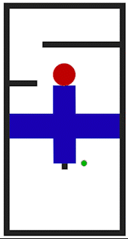
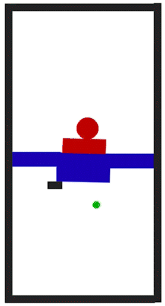
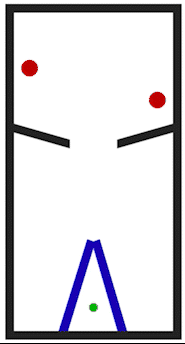
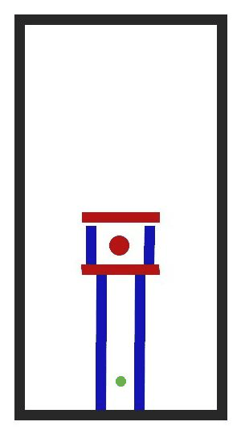
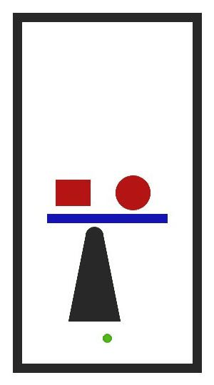
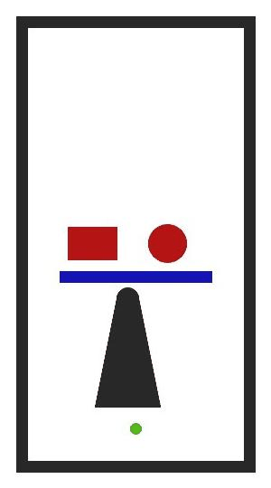
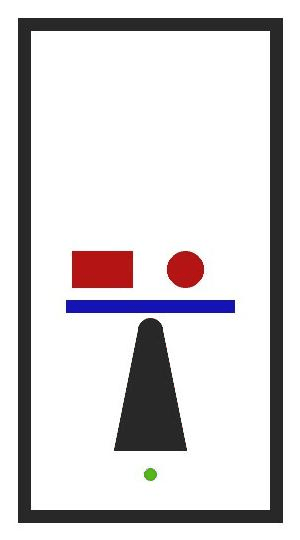
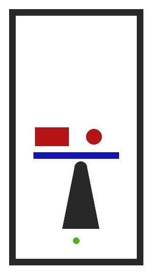

# 2500-RL-Benchmark

Our benchmark is attempting to evaluate the performance of reinforcement learning agents for solving intuitive physics tasks. In more detail, we want the benchmark to focus on an embodied agent's ability to reason about its 2D dynamic environment in pursuit of a clearly defined goal. We draw inspiration from the PHYRE benchmark developed by Facebook, for their approach to within and cross-template testing, and their implementation of a consistent testing environment. 

In our current design, the agent will be able to move up/down/left/right (as its action space) in each timestamp, and the agent will not be affected by the gravity. The agent will start at the bottom of the scenario, and the current goal of the agent is to move to the top of the scenario as soon as possible. In the environment, there exist some dynamic (moveable) objects which can be affected by gravity and can collide with each other; agents need to avoid touching red objects, but it is safe to touch blue objects. Therefore, we expected our reinforcement agent will have to reason about the physics interaction and object trajectory in order to find achieve the top quickly.

# Templates:

## Friction Inference:
|  |  |  |

## Structure:
|  |  |

## Continuous range of variants within each template:
| v=0.0 | v=0.25 | v=0.5 | v=0.75 | v=1.0 |
|:-:|:-:|:-:|:-:|:-:|
|  |  |  |  |  |
