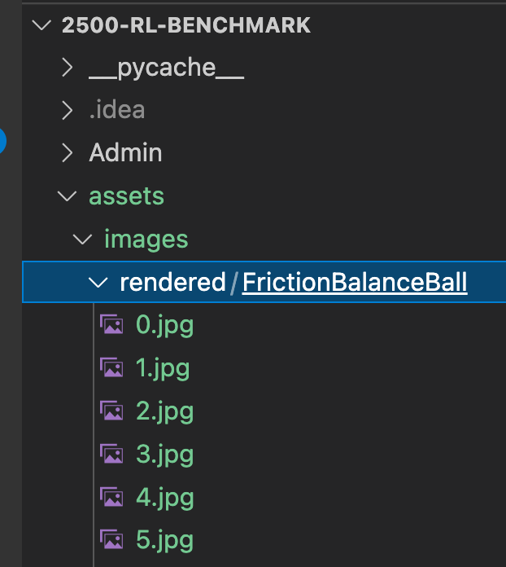

<!-- -->

# 1: Install Anaconda
Go to: https://docs.anaconda.com/anaconda/install/windows/  
or the page relevant to your OS  
Follow the instructions to install Anaconda  
You should know that it is installed correctly when you type <code> conda -h </code> in your command prompt and help is displayed  

# 2: Create new conda environment:
[Update: it is OK to skip create new conda environment (step 2 & 3), so the box2d can be installed in the base environment. 
Have box2d in the base environment allows IDE to recognize box2d classes and allow IDE to directly run the application!]

Open a terminal in your coding environment (I am using VSCode) and create a new conda environment (can use different name):  
<code> conda create --name RLIPBM-py_10 python=3.10 </code>  

# 3: Activate environment:
[Update: it is OK to skip create new conda environment (step 2 & 3), so the box2d can be installed in the base environment. 
Have box2d in the base environment allows IDE to recognize box2d classes and allow IDE to directly run the application!]

<code> conda activate RLIPBM-py_10 </code>  
Note: python BMTemplateTester.py would currently throw an error because the packages are not installed  

# 4: Add necessary packages:
While in the conda environment:  
<code> conda install -c conda-forge pybox2d </code>  
<i> That install is (I think) why conda is necessary </i>  
<code> pip install pygame </code>  
 
We might also be needing Tensorflow soon:  
<code> pip install tensorflow </code>  
<code> pip install tf-agents </code>  

# 5: Run the BMTemplateTester:
While in the conda environment:  
python BMTemplateTester.py  

# 5B: Instead of run the BMTemplateTester, run BMApplication: 
Move to source code dictionary if currently in the root dictionary: 

<code> cd src </code>  

While in the source code dictionary, run the BMApplication by: 

<code> python BMApplication.py seesaw </code>  

The following parameters can be specified for the application: 
- t (template): required, indicate use which template, can be roof, seesaw...
- v (variant number): optional, generate variant task from the template, range=[0.0,1.0], default=0.0
- a (agent name): optional, specify use which agent, default=human
- r (reward function name): optional, specify use which reward function, can be zero, penalty...; default=zero
- render_image: optional: default to `False`. If used, images of current episode will be rendered into the specified path.
- render_path: optional: default to \'../assets/images/rendered/\'. A folder containing rendered images will be generated in the specified path.

For example, following parameter can run roof template with variant number 0.5, with penalty reward function, but does not generate any rendered image: 

<code> python BMApplication.py roof --v 0.5 --r penalty </code>  

If want to generate rendered images: 

<code> python BMApplication.py roof --v 0.5 --r penalty --render-image </code>  

Specifiy the path to  generate rendered images: 

<code> python BMApplication.py roof --v 0.5 --r penalty --render-image 'path/to/dir/' </code>  

Sample renderer output (default path):

# 6: Select the interpreter from this environment:
In VSCode, you can choose your interpreter to be this conda environment by having the Python Extension installed and by opening the command pallette and selecting 'select interpreter'.  
You can also use the command palette to create a new python terminal, which automaticlaly activates the selected conda environment!